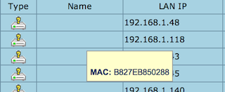

# Check IP Address of Rpi

1. Login to your **router console** and look at the list of devices
 
 
2. Sometimes, the raspberry pi does not present a hostname and becomes a challenge to identify the IP!
 
 
3. Fortunately, we know that the Rpi MAC add prefix is: `B8:27:EB`

Once you have retrieved the IP Address, we are good to go!

 
 
*Licensed under: Attribution-ShareAlike 4.0 International (CC BY-SA 4.0)*

